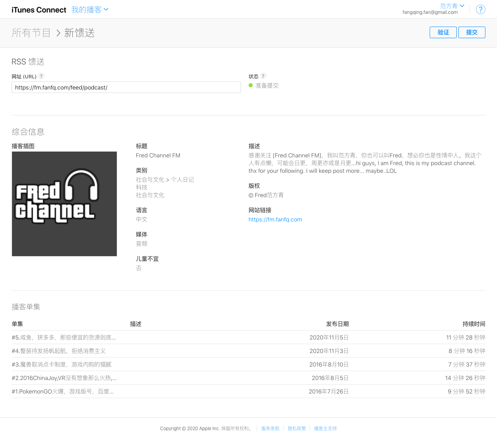

解决podcast 收录验证问题，验证网址
https://podba.se/validate/?url=https://fm.fanfq.com/feed/podcast/

解决后的效果如下


APPLE PODCAST 验证



原工程
https://github.com/bestony/hexo-generator-podcasts/

以下是修改步骤

1.用本工程源码中 `_feed.xml` 替换掉原工程 `template/feed.xml`

2.注意新的`feed.xml`这里是hardcode，以后有空我会解决这个bug，主要nodejs代码不熟。

```
<!-- 这个地方hardcode一下  -->
<!-- 这个地方hardcode一下  -->
<!-- 这里虽然可以填多个分类，但只有第一个会显示出来,我的频道目前还没有明确的定位先以日记以及科技为分类 -->
<!-- 分类对应表看整理 https://help.apple.com/itc/podcasts_connect/#/itc9267a2f12-->
<itunes:category text="Society &amp; Culture">
	<itunes:category text="Personal Journals" />
</itunes:category>

<itunes:category text="Technology">
	<itunes:category text="Tech News" />
</itunes:category>

<!-- bugfix -->
<copyright>
	&#169; {{copyright}}
</copyright>

```

hexo 的`_config.yml` 这个地方代码失效，因为直接在`feed.xml`hardcode了
```
category: 
    - Arts
    - Design
```


文章结构示例
```
---
title: "#4.整装待发扬帆起航，拒绝消费主义"  #文章标题
category: podcast #固定值
media: https://dl.fanfq.com/fm.fanfq.com/004.mp3  #固定值，建议放CDN 
image: https://dl.fanfq.com/fm.fanfq.com/fred_1024x1024_fm.jpg   #固定值，建议放CDN 
duration: 600  #mp3文件播放时长，这里单位是秒
type: audio/mpeg #固定值
length: 11924508  #mp3文件的字节数，右键文件查看所占磁盘空间
layout: podcast  #固定值
date: 2020-11-03 21:21:57 #创建时间
tags: [播客,消费主义] #文章标签
urlname: vol4 #比如我这里最终文章的链接是 https://fm.fanfq.com/vol4.html
description: 轻奢，小资，精致，这些词是不是听起来有点耳熟?在我看来这些词都是消费主义的簇拥者自己创造出来的文化，通过这种方式给消费者洗脑最终促使消费者买单。 #这个描述，为了填充feed用而不是正文
---

 #播放器

文章正文...
```

好了这样就解决podcast的验证问题了

我的播客内容分发站 https://fm.fanfq.com


podcast运营交流，技术交流


